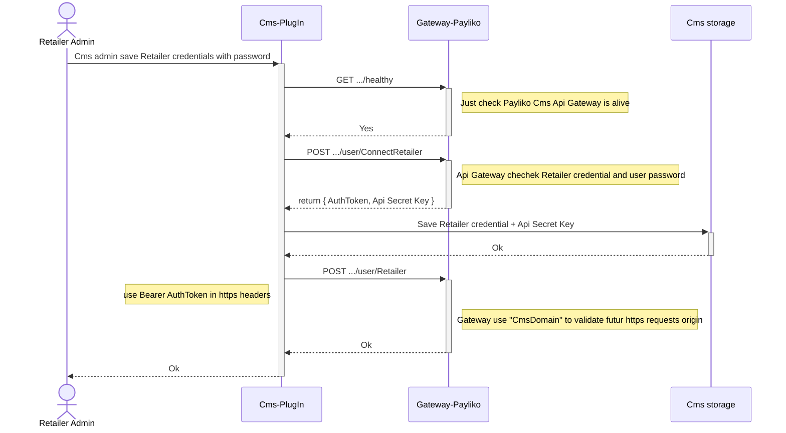
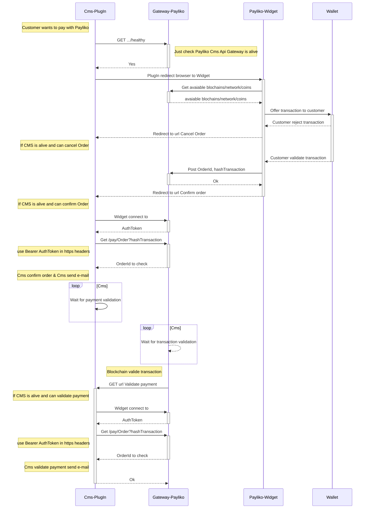

# Backend Payliko
Inhouse CMS integration

 
Copyright (c) 2020-2023 PayInnov

#

  
  
  

# Prerequires

To implement integration of Payinnov crypto currency paiment in a inhouse CMS you need an PayInnov merchant account to get:
 - Uuid string as a Retailer'certificate
 - API Secret Key

 # Swagger of gateway-cms

 https://tests.payliko-demo.fr/gateway-cms/documentation/static/index.html

 # Cms registring retailer in Payinnov ApiGateway

Use https://mermaid-js.github.io/mermaid-live-editor to update graphs.

*Sequence diagram*

## Cms payment with Payinnov ApiGateway

*Sequence diagram*

